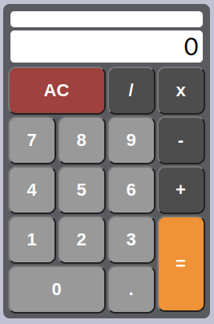

# **Calculator**

> App that allows you to do your arithmetic calculations

Available live [here](https://fernet87.github.io/calculator/) 

## About the Project

<p align="center">
  
</p>

This is a React based app to Build a javascript calculator for [freeCodeCamp](https://www.freecodecamp.org/learn/front-end-development-libraries/front-end-development-libraries-projects/build-a-javascript-calculator) Front End Development Libraries project.
In this calculator app you can easily do your arithmetic calculations and check your formula in one top output field and the result in a second output field which is under the formula field.
## **Technologies used for this project.**

[](https://html.spec.whatwg.org/multipage/) [](https://www.css3.com/) [](https://developer.mozilla.org/en-US/docs/Web/JavaScript)
[](https://reactjs.org/) [](https://sass-lang.com/)

### **How to start project**

Install project dependecies:

```
npm install
```

Start the web server

```
npm start
```
